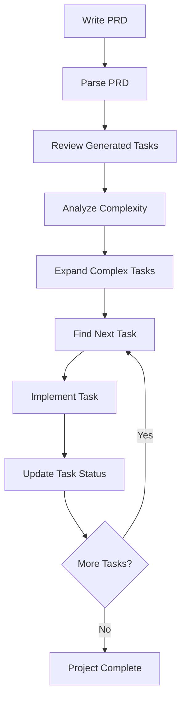
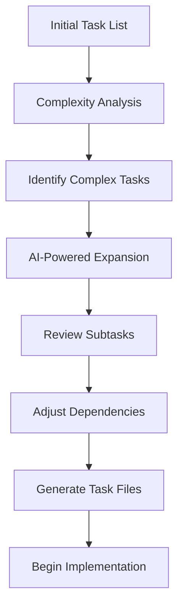

# Task Master Analysis: Comprehensive Functionality Overview

## Executive Summary

The claude-task-master repository is a sophisticated AI-driven task management system designed to work seamlessly with AI assistants like Claude through the Model Context Protocol (MCP). It provides comprehensive project task management capabilities with advanced features including PRD parsing, AI-powered task generation, dependency management, and complexity analysis.

**Version:** 0.15.0  
**Architecture:** Node.js-based with MCP integration  
**Primary Use Case:** AI-assisted development workflow management  
**Key Integration:** Cursor AI, VS Code, Windsurf editors via MCP  

## Core Architecture & Design Patterns

### 1. Multi-Layer Architecture

The system employs a sophisticated multi-layer architecture:

```
┌─────────────────────────────────────────┐
│           User Interface Layer          │
│  ┌─────────────────┐ ┌─────────────────┐│
│  │   CLI Commands  │ │   MCP Server    ││
│  │   (Commander.js)│ │   (FastMCP)     ││
│  └─────────────────┘ └─────────────────┘│
├─────────────────────────────────────────┤
│           Service Layer                 │
│  ┌─────────────────┐ ┌─────────────────┐│
│  │  Task Manager   │ │  AI Services    ││
│  │  Core Logic     │ │  Unified Layer  ││
│  └─────────────────┘ └─────────────────┘│
├─────────────────────────────────────────┤
│           Data Layer                    │
│  ┌─────────────────┐ ┌─────────────────┐│
│  │   tasks.json    │ │ Individual Task ││
│  │  (Source of     │ │     Files       ││
│  │   Truth)        │ │                 ││
│  └─────────────────┘ └─────────────────┘│
└─────────────────────────────────────────┘
```

### 2. Dual Interface Pattern

The system provides two complementary interfaces:

**CLI Interface** (`index.js`, `bin/task-master.js`):
- Direct command-line execution
- Subprocess spawning for complex operations
- Traditional CLI workflow support

**MCP Server Interface** (`mcp-server/server.js`):
- Model Context Protocol integration
- Real-time AI assistant communication
- Editor-embedded functionality

### 3. Provider Pattern for AI Services

The AI services layer implements a sophisticated provider pattern:

```javascript
// From scripts/modules/ai-services-unified.js
const PROVIDER_FUNCTIONS = {
    anthropic: {
        generateText: anthropic.generateAnthropicText,
        streamText: anthropic.streamAnthropicText,
        generateObject: anthropic.generateAnthropicObject
    },
    perplexity: {
        generateText: perplexity.generatePerplexityText,
        streamText: perplexity.streamPerplexityText,
        generateObject: perplexity.generatePerplexityObject
    },
    // ... additional providers
};
```

**Supported AI Providers:**
- Anthropic (Claude)
- OpenAI (GPT models)
- Google (Gemini)
- Perplexity (Research-focused)
- xAI (Grok)
- OpenRouter (Multi-model gateway)
- Ollama (Local models)

### 4. Direct Function Pattern

The MCP server implements a "direct function" pattern where tools call core functions directly:

```javascript
// From mcp-server/src/core/task-master-core.js
export const directFunctions = new Map([
    ['listTasksDirect', listTasksDirect],
    ['parsePRDDirect', parsePRDDirect],
    ['addTaskDirect', addTaskDirect],
    // ... 20+ direct functions
]);
```

This pattern provides:
- Consistent error handling
- Uniform logging
- Standardized response formats
- Easy testing and maintenance

## Core Features & Capabilities

### 1. Task Data Structure

**Primary Storage:** `tasks/tasks.json` - Single source of truth

**Task Schema:**
```json
{
  "id": 1,
  "title": "Task Title",
  "description": "Brief description",
  "status": "pending|in-progress|done|deferred",
  "dependencies": [2, 3],
  "priority": "high|medium|low",
  "details": "Detailed implementation instructions",
  "testStrategy": "Verification approach",
  "subtasks": [
    {
      "id": 1,
      "title": "Subtask title",
      "description": "Subtask description",
      "status": "pending|done",
      "details": "Implementation details"
    }
  ]
}
```

**Key Features:**
- Hierarchical task structure with subtasks
- Dependency tracking with circular dependency detection
- Priority-based task ordering
- Status lifecycle management
- Rich metadata for AI context

### 2. PRD (Product Requirements Document) Processing

**Core Function:** `parsePRDDirect` 

**Workflow:**
1. Parse PRD from text file (`scripts/prd.txt`)
2. AI analysis using configured main model
3. Task generation with configurable count
4. Dependency inference
5. Priority assignment
6. Test strategy generation

**Advanced Features:**
- Research mode using Perplexity AI for enhanced analysis
- Append mode for incremental task addition
- Force mode for complete regeneration
- Configurable task count via `.taskmasterconfig`

**Example Usage:**
```bash
task-master parse-prd scripts/prd.txt --research --num-tasks=20
```

### 3. AI-Powered Task Management

**Task Generation:**
- Natural language task creation
- AI-enhanced task details and test strategies
- Automatic priority and dependency inference

**Task Expansion:**
```javascript
// From mcp-server/src/core/direct-functions/expand-task.js
export async function expandTaskDirect(args, log, context = {}) {
    // AI-powered task breakdown into subtasks
    // Complexity-based subtask count recommendation
    // Research-enhanced expansion when enabled
}
```

**Complexity Analysis:**
- AI-driven complexity scoring (1-10 scale)
- Subtask count recommendations
- Expansion prompt generation
- Comprehensive complexity reports

### 4. Dependency Management

**Features:**
- Dependency validation with circular detection
- Automatic dependency fixing
- Dependency visualization in task lists
- Prerequisite tracking for next-task selection

**Implementation:**
```javascript
// Dependency validation logic
export async function validateDependenciesDirect(args, log, context = {}) {
    // Check for circular dependencies
    // Verify dependency existence
    // Generate fix recommendations
}
```

### 5. Advanced Task Operations

**Task Discovery:**
- Smart "next task" selection based on:
  - Dependency satisfaction
  - Priority levels
  - Task status
  - Complexity scores

**Task Manipulation:**
- Add/remove tasks and subtasks
- Status management with history tracking
- Task movement and reorganization
- Bulk operations (expand-all, clear-subtasks)

**File Generation:**
- Individual task files from JSON data
- Formatted markdown output
- Template-based generation
- Sync between JSON and files

## Input/Output Formats

### 1. Task File Format

Individual task files follow a structured format:

```markdown
# Task ID: 5
# Title: Implement Authentication System
# Status: pending
# Dependencies: 1, 3
# Priority: high
# Description: Implement user authentication with OAuth2

# Details:
- Set up OAuth2 configuration
- Implement login/logout endpoints
- Add session management
- Create user profile system

# Test Strategy:
- Unit tests for auth endpoints
- Integration tests for OAuth flow
- Manual testing with real OAuth providers
```

### 2. JSON API Responses

MCP tools return standardized response formats:

```json
{
  "success": true,
  "data": {
    "message": "Operation completed successfully",
    "outputPath": "/path/to/tasks.json",
    "telemetryData": {
      "operation": "parse-prd",
      "duration": 5230,
      "tasksGenerated": 15
    }
  }
}
```

Error responses:
```json
{
  "success": false,
  "error": {
    "code": "TASK_NOT_FOUND",
    "message": "Task with ID 99 not found"
  }
}
```

### 3. Configuration Formats

**Project Configuration (`.taskmasterconfig`):**
```json
{
  "models": {
    "main": {
      "provider": "anthropic",
      "modelId": "claude-3-7-sonnet-20250219",
      "maxTokens": 64000,
      "temperature": 0.2
    },
    "research": {
      "provider": "perplexity",
      "modelId": "sonar-pro",
      "maxTokens": 8700,
      "temperature": 0.1
    }
  },
  "global": {
    "logLevel": "info",
    "defaultSubtasks": 5,
    "defaultPriority": "medium"
  }
}
```

## Integration Points

### 1. MCP (Model Context Protocol) Integration

**Server Implementation:**
```javascript
// From mcp-server/src/index.js
class TaskMasterMCPServer {
    constructor() {
        this.server = new FastMCP(this.options);
        this.initialized = false;
    }
    
    async init() {
        registerTaskMasterTools(this.server, this.asyncManager);
        this.initialized = true;
    }
}
```

**Tool Registration:**
The system registers 25+ MCP tools organized in logical groups:
- Initialization & Setup
- Task Listing & Viewing  
- Task Status & Management
- Task Creation & Modification
- Task Analysis & Expansion
- Dependency Management

**Editor Integration:**
- **Cursor AI:** Global and project-level configuration
- **VS Code:** Project-level MCP configuration
- **Windsurf:** Global MCP configuration

### 2. AI Provider Integration

**Multi-Provider Support:**
- Unified interface across all providers
- Provider-specific optimizations
- Failover mechanisms
- Cost tracking and optimization

**Configuration Management:**
- Role-based model assignment (main, research, fallback)
- Provider-specific parameter tuning
- Dynamic model switching
- API key management

### 3. File System Integration

**Project Structure Integration:**
- Automatic project root detection
- Relative path resolution
- Directory structure creation
- File synchronization between JSON and markdown

**Configuration Discovery:**
```javascript
// From scripts/modules/config-manager.js
function findProjectRoot(startDir) {
    // Traverse up directory tree
    // Look for .taskmasterconfig, package.json, .git
    // Return project root or default to current directory
}
```

## Extensibility Mechanisms

### 1. Provider System Architecture

**Adding New AI Providers:**
1. Create provider module in `src/ai-providers/`
2. Implement standard interface: `generateText`, `streamText`, `generateObject`
3. Add to `PROVIDER_FUNCTIONS` map
4. Update configuration schema

**Example Provider Structure:**
```javascript
// src/ai-providers/custom-provider.js
export async function generateCustomProviderText(options) {
    // Provider-specific implementation
    // Must return standardized response format
}
```

### 2. Tool Extension System

**Adding New MCP Tools:**
1. Create tool file in `mcp-server/src/tools/`
2. Implement direct function in `mcp-server/src/core/direct-functions/`
3. Register tool in `tools/index.js`
4. Add to core exports

**Tool Template:**
```javascript
export function registerCustomTool(server) {
    server.addTool({
        name: 'custom_operation',
        description: 'Performs custom operation',
        parameters: z.object({
            // Zod schema validation
        }),
        execute: withNormalizedProjectRoot(async (args, { log, session }) => {
            // Implementation
        })
    });
}
```

### 3. Configuration Extension

**Custom Configuration Fields:**
The configuration system supports arbitrary fields in `.taskmasterconfig`:

```json
{
  "models": { /* ... */ },
  "global": { /* ... */ },
  "customSettings": {
    "projectSpecificSetting": "value",
    "integrationConfig": {
      "apiEndpoint": "https://custom.api.com"
    }
  }
}
```

### 4. Task Schema Extension

**Custom Task Fields:**
Tasks support additional fields beyond the core schema:

```json
{
  "id": 1,
  "title": "Core Task",
  // ... core fields
  "customMetadata": {
    "estimatedHours": 8,
    "assignee": "developer@company.com",
    "tags": ["frontend", "urgent"]
  }
}
```

## Task Management Workflows

### 1. Standard Development Workflow



### 2. AI-Assisted Task Refinement



### 3. Dependency-Driven Workflow

**Next Task Selection Algorithm:**
1. Filter tasks by status (pending/in-progress)
2. Check dependency satisfaction
3. Sort by priority (high → medium → low)
4. Sort by dependency count (fewer dependencies first)
5. Sort by task ID (creation order)
6. Return first eligible task

**Implementation:**
```javascript
// From scripts/modules/task-manager/find-next-task.js
export default function findNextTask(tasks) {
    const eligibleTasks = tasks.filter(task => {
        return (task.status === 'pending' || task.status === 'in-progress') &&
               task.dependencies.every(depId => 
                   tasks.find(t => t.id === depId)?.status === 'done'
               );
    });
    
    return eligibleTasks.sort(taskComparator)[0];
}
```

## Advanced Features

### 1. Research-Enhanced Generation

**Perplexity Integration:**
- Web search for domain-specific context
- Technical best practices incorporation
- Industry standard compliance
- Real-time information inclusion

**Usage:**
```bash
task-master parse-prd --research
task-master expand --id=5 --research
```

### 2. Complexity Analysis System

**AI-Driven Scoring:**
- Analyzes task complexity on 1-10 scale
- Considers technical difficulty, scope, dependencies
- Generates expansion recommendations
- Creates ready-to-use expansion commands

**Report Generation:**
```json
{
  "taskId": 5,
  "complexity": 8,
  "recommendedSubtasks": 7,
  "expansionPrompt": "Break down authentication system implementation...",
  "expansionCommand": "task-master expand --id=5 --subtasks=7 --research"
}
```

### 3. Telemetry and Analytics

**Operation Tracking:**
- Command execution times
- AI token usage
- Error rates and types
- Task completion metrics

**Cost Management:**
- Token usage tracking per provider
- Cost estimation and reporting
- Budget alerts and limits
- Provider optimization recommendations

## Testing Architecture

### 1. Test Structure

**Comprehensive Test Suite:**
- Unit tests for core functionality
- Integration tests for MCP tools
- End-to-end workflow testing
- Performance and load testing

**Test Organization:**
```
tests/
├── unit/                    # Isolated component tests
│   ├── task-manager.test.js
│   ├── config-manager.test.js
│   └── ai-services.test.js
├── integration/             # Cross-component tests
│   ├── cli/commands.test.js
│   └── mcp-server/tools.test.js
├── e2e/                     # End-to-end workflows
│   └── full-workflow.test.js
└── fixtures/                # Test data
    ├── sample-tasks.js
    └── sample-prd.txt
```

### 2. Testing Strategies

**Mock AI Responses:**
```javascript
// tests/fixtures/sample-claude-response.js
export const sampleTaskGenerationResponse = {
    tasks: [
        {
            id: 1,
            title: "Generated Task",
            description: "AI-generated description",
            // ... complete task structure
        }
    ]
};
```

**Integration Testing:**
- Real API calls with test accounts
- Fallback to mock responses
- Environment-based test configuration
- Cleanup and teardown procedures

## Security Considerations

### 1. API Key Management

**Environment-Based Security:**
- API keys stored in environment variables only
- No hardcoded credentials in codebase
- MCP-level key isolation
- Project-specific key scoping

### 2. Input Validation

**Comprehensive Validation:**
- Zod schema validation for all MCP tools
- File path sanitization
- Command injection prevention
- JSON schema validation

**Example Validation:**
```javascript
// From mcp-server/src/tools/add-task.js
parameters: z.object({
    prompt: z.string().optional().describe('Description of the task'),
    title: z.string().optional().describe('Task title'),
    dependencies: z.string().optional().describe('Comma-separated task IDs'),
    projectRoot: z.string().describe('Project directory (absolute path)')
})
```

### 3. File System Security

**Path Security:**
- Absolute path requirements
- Directory traversal prevention
- Permission checking
- Safe file operations

## Performance Optimizations

### 1. Caching Strategies

**Configuration Caching:**
- In-memory configuration cache
- File system change detection
- Lazy loading of provider modules
- Optimized path resolution

### 2. AI Request Optimization

**Request Batching:**
- Multiple tasks in single API call
- Prompt optimization for token efficiency
- Response caching for similar requests
- Provider-specific optimizations

### 3. File I/O Optimization

**Efficient File Operations:**
- Atomic file writes
- Batch file operations
- Memory-efficient JSON parsing
- Asynchronous I/O throughout

## Conclusion

The claude-task-master repository represents a sophisticated, production-ready task management system specifically designed for AI-assisted development workflows. Its architecture demonstrates several advanced patterns:

**Strengths:**
- **Comprehensive AI Integration:** Support for 7+ AI providers with unified interface
- **Sophisticated Architecture:** Multi-layer design with clear separation of concerns
- **Rich Feature Set:** 25+ MCP tools covering complete task management lifecycle
- **Extensibility:** Plugin-like architecture for providers, tools, and configurations
- **Production Quality:** Comprehensive testing, error handling, and security measures

**Key Innovations:**
- **MCP-First Design:** Native integration with modern AI development environments
- **Research-Enhanced AI:** Integration with Perplexity for web-augmented task generation
- **Complexity Analysis:** AI-driven task complexity assessment and breakdown recommendations
- **Dependency Intelligence:** Sophisticated dependency management with circular detection

**Use Cases:**
- Large-scale software development projects
- AI-assisted development workflows
- Complex project planning and management
- Cross-functional team coordination
- Technical documentation and requirement analysis

This system represents a mature approach to bridging human project planning with AI execution capabilities, providing a robust foundation for scaled AI-assisted development workflows.